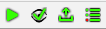
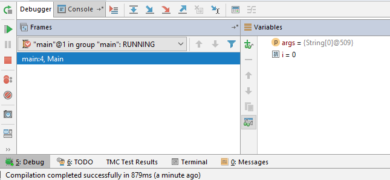



## Debugging using a debugger

To see the contents of variables so far, we've been using the `System.out.println()` command. This works fine for showing the contents of simple variables, or the flow of execution in a simple program, but when programs get more complicated, the output will also get more complicated. This is why there are other tools available to debug your program, a debugger.

A debugger can pause the execution of your program, so you can view the values of variables, and then allow you to run your code line by line to see the flow of execution.

So far we've been using the TMC plugin's run buttons  to start our program. In order to run the program with debugging, we have to use the debug {: .key .light} button, or use the debug option in the run menu. Running the program with a debugger won't change anything about the execution of your program, so you won't see a difference by just pressing debug

To pause the execution to inspect, a **breakpoint** can be added to the code. This is done by clicking in the gutter of your code window (just right of the line number). A red dot will appear to show the position of the breakpoint. To remove the breakpoint, just click the red dot to remove it. When running the code with a debugger and a breakpoint, the execution will pause the moment java starts executing that line. The line with the breakpoint will not have been executed yet.

When pausing execution, a debugging window will appear in the bottom of IntelliJ. This is a powerful view into your application, with a lot of buttons and features. 

On the left side are buttons for
- {: .key .light} restarting  
  This will restart the running application
- {: .key .light} resuming  
  Only available when the application is not running. If the application is paused, it will continue running until it hits another breakpoint. If the application is not running, it will start the application
- {: .key .light} pausing  
  If the application is running (and doing some heavy computation or maybe an infinite loop, so it appears 'frozen'), this will pause the application. It will show exactly which line currently is executing, so it is a very good tool to find infinite loops
- {: .key .light} killing  
  Instantly stops the current running application. The program is just removed from memory

On the top are buttons for
- {: .key .light} Show execution point  
  This will move the code view to the line that is currently executing. This is handy if you scrolled through a lot of code while debugging, and you want to go back to the line that is currently running and showing the problem
- {: .key .light} Step Over  
  This will run the current line of code, and move to the next line.
- {: .key .light} Step Into  
  This will step into the method called in the current line. See chapter 2-9 for more details 
- {: .key .light} Force Step Into  
  This will step into the method called in the current line. See chapter 2-9 for more details
- {: .key .light} Step Out  
  This will finish the current method, and break at the end of this method. See chapter 2-9 for more details
- {: .key .light} Run to cursor  
  This will continue code execution, and will place a temporary breakpoint at the cursor. This is very convenient when debugging code with a lot of loops, as you don't have to step through the code line by line, but you can just run the code until the end of the loop, without having to add a breakpoint and resuming

The main view consists of 2 parts, on the left is the call stack (we'll go more in depth into the callstack in chapter 2-9), and the variables windows. The variables windows is used to view the contents of variables. By default, all the 'used' variables are shown, so if your program uses a variable called `months`, this variable will automatically be shown here. It is also possible to add variables or expressions in the watch, by double-clicking and typing the name of the variable, or the expression

The process of debugging is usually used to see if the program is doing what you have in mind, validate the code execution path and check the variable contents to see if they are valid. This means a lot of manual stepping through the code, step by step, and takes a lot of time. This is why debugging can take a lot of time, and is better avoided by thinking before you start typing

<iframe id="kaltura_player" src="https://cdnapisec.kaltura.com/p/2056781/sp/205678100/embedIframeJs/uiconf_id/34302741/partner_id/2056781?iframeembed=true&playerId=kaltura_player&entry_id=1_eo3gc4eo&flashvars[streamerType]=auto&amp;flashvars[localizationCode]=en&amp;flashvars[leadWithHTML5]=true&amp;flashvars[sideBarContainer.plugin]=true&amp;flashvars[sideBarContainer.position]=left&amp;flashvars[sideBarContainer.clickToClose]=true&amp;flashvars[chapters.plugin]=true&amp;flashvars[chapters.layout]=vertical&amp;flashvars[chapters.thumbnailRotator]=false&amp;flashvars[streamSelector.plugin]=true&amp;flashvars[EmbedPlayer.SpinnerTarget]=videoHolder&amp;flashvars[dualScreen.plugin]=true&amp;flashvars[hotspots.plugin]=1&amp;flashvars[Kaltura.addCrossoriginToIframe]=true&amp;&wid=1_0jt9bm6g" width="460" height="258" allowfullscreen webkitallowfullscreen mozAllowFullScreen allow="autoplay *; fullscreen *; encrypted-media *" sandbox="allow-forms allow-same-origin allow-scripts allow-top-navigation allow-pointer-lock allow-popups allow-modals allow-orientation-lock allow-popups-to-escape-sandbox allow-presentation allow-top-navigation-by-user-activation" frameborder="0" title="Kaltura Player"></iframe>