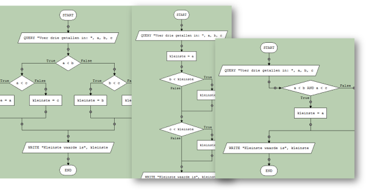
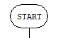
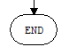
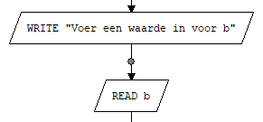
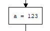
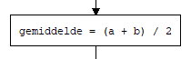
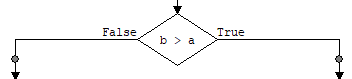
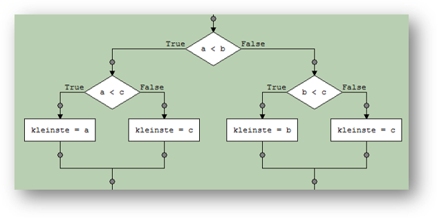
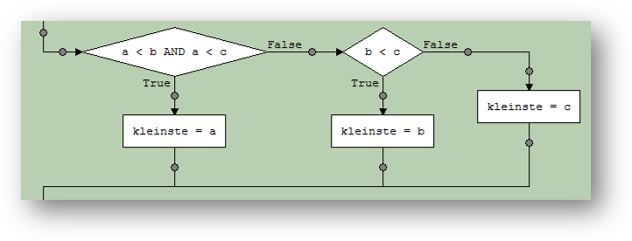
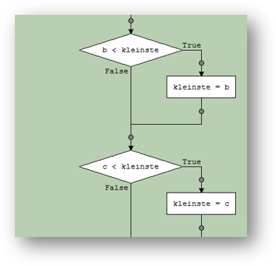



## Flowcharts

> We have prepared a video clip to provide a quick overview of flowcharts and how to use them. You should watch that video and do the **exercise** in the video. The video clip is Dutch spoken and is called "Wat is een flowchart?" (What is a flowchart?).

### What is a flowchart?

A flowchart is one of the ways in which we can visualize an algorithm. Flowcharts (Dutch: stroomschema's) are *graphical* representations of algorithms. They consist of a sequence of *processing steps* (drawn as blocks of different shapes) connected by *arrows*. The operating principle is extremely simple: follow the arrows to visualize the working of the algorithm.

### Elements of a flowchart

Before we can draw a flowcharts, we should agree on the shapes of the various types of elements. Let's start with the most basic shapes:

- START element: execution of the flowchart starts at this point 

- END element: execution of the flowchart ends at this point 

- INPUT and OUTPUT elements: when a WRITE element executes, a message is printed on the screen; when a READ element excutes, the user should enter a value using the keyboard, which is then stored in the variable according to this element. 

- ASSIGNMENT element: an assignment calculates a new value for a variable and stores this value in the variable.

- IF element: when this element executes, the algorithm calculates the value of a condition (as specified in this element) and chooses which one of two possible paths to follow, based on whether the condition has the value `true` or the value `false`. This allows algorithms to make decisions.

>*We will encounter more elements later, such as WHILE, REPEAT, FOR and MODULE calls*

These elements are connected by arrows that indicate in what sequence these processing steps are executed.

- Each element has one entry point for an arrow (or multiple arrows coming from other elements), except for START of course (because this is where the first arrow starts).
- Each element also has one exit point from where an arrow points to the next element, with two exceptions: IF has two exit points (one each for `true` and `false`) and END obviously has no exit points because this is where the last arrow ends.

The choice element (if-statement in Java) can be drawn in various ways, with the outgoing arrows to the left, right or down, depeding on your preference. These examples are all created using the educational software LARP:
  




{: .exercises }
