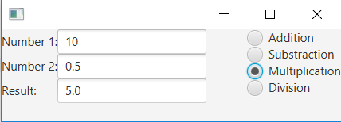

>>### Exercise gui-extra-1 Calculator
>>
>>In this exercise you will create a GUI calculator using RadioButtons. The end result of the program looks like this:
>>
>>
>>
>>#### gui-extra-1.1 Create the GUI
>>
>> The first step is to create a semilair GUI as shown the image above. On the left side of the screen add two `TextField`s with labels in front of it. On the right side of the screen add 4 RadioButtons with the text: *Addition*, *Substraction*, *Multiplication* and *Division*
>>
>>#### gui-extra-1.2 Implement the functionality
>>
>> The next step is to implement the functionality to our calculator.  When the user changes the selection of the `RadioButton`s the program should calculate the result of *number1 (operator from checkbox) number2*
>>
>{: .exercise }