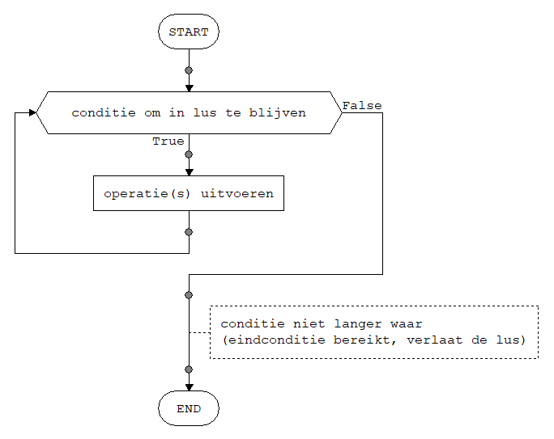
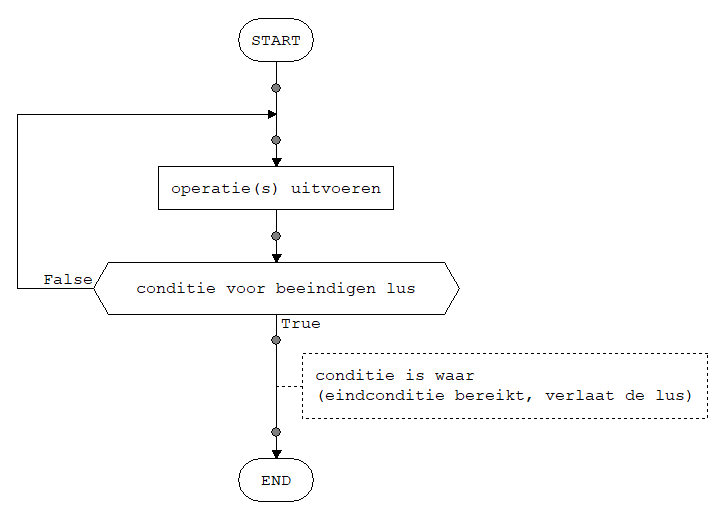



> We have prepared several video clips to introduce the concept of loops in programming. Watch those videos and do the exercises in the videos. Then come back and read the explanation and summary below.

### Iterative algorithms

Many algorithms are *iterative* in nature, i.e. they repeat several steps by jumping back to a previous point in the sequence under specific conditions. Such a repetition of steps is called a **loop**.

### Loops in flowcharts

In a flowchart a loop can be represented in two different ways:

- WHILE loop: in this type of loop the condition that determined whether the loop repeats is checked at the *start* of the loop.

- REPEAT-UNTIL loop: in this type of loop the condition that determines whether the loop repeats is checked at the *end* of the loop.

### When to stop iterating: end condition

A loop repeats all its steps until a specific *end condition* is fulfilled. As soon as the end condition is met (i.e. is `true`) looping stops and processing continues after the loop. This check is performed only once each time the loop repeats, either at the start of the loop (while loop) or at the end of the loop (repeat-until loop).
An *infinite* loop (or endless loop) occurs when the end condition is *never met*. Such a loop that repeats indefinitely and never terminates is something to be avoided (except in very specific circumstances such as event loops in embedded systems that are supposed to never stop working).

So for every loop we should ensure that the end condition of the loop will be fulfilled at some point, to guarantee that the loop will eventually terminate. This should happen independently of any input values. It is not sufficient to show that the end condition *can* be fulfilled for some input values. It must always be fulfilled at some point, or we might end up with an infinite loop.

> Common mistake in end conditions for loops: the loop has a counter that must count up or down to a specific value but we have forgotten to actually update the counter in the loop.
>
> *Proving* that a loop will always terminate is possible but not easy, so in this introduction to loops we will not attempt such a formal proof. However, we should still convince ourselves by logically analysing the end condition that it will eventually be fulfilled.




{: .exercises }

If you have completed all exercises and if you are experienced in programming (or you just like a challenge), you can try to solve the challenge below:


{: .exercises }