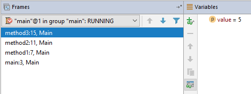



## Callstack

When methods call each other, they form what is called a *calls stack*. This is a list of methods, where each method has been called by the entry over it in the list. The call stack in IntelliJ is shown when the application is paused in the debugger. Concider the following program

```java
public class Main {
    public static void main(String[] args) {
        method1(10);
    }

    public static void method1(int value) {
        method2(value+1);
    }

    public static void method2(int value) {
        method3(value/2);
    }

    public static void method3(int value) {
        System.out.println(value);
    }
}
```
{: .interactive #method-callstack-1 }

If we put a breakpoint at the line with the `System.out.println` code, and look at IntelliJ, we get the following callstack:



Here you can see the main method called the method1, which in turn called method2, which in turn called method3. You can also see the linenumbers in this callstack, and even click on a line in the callstack to see the variables in that context. By clicking through the different methods, you can see the variable `value` change in every method, so it is very easy to trace back what happened

Some other debugging features that can help you debug your code with methods are the stepping features

- {: .key .light} Step Over  
  This will run the current line of code, and move to the next line. If there are any method calls in the current line of code, the debugger will just step over the code in that method, so you don't have to step through it
- {: .key .light} Step Into  
  This will step into any methods called in the current line, and eventually go to the next line if all methods on that line have been called. This is useful to see what happens in a method 
- {: .key .light} Force Step Into  
  Same as the normal step into, but it will also step into methods that are usually not stepped into. Most methods in the Java language or other libraries are skipped over when using step into, but by using force step into, the code steps into these methods as well
- {: .key .light} Step Out  
  This will finish the current method, and go up one level in the callstack. This is useful for instance if you just want to validate the parameters passed to a function when they are a complicated expression

This call stack can also be retrieved while the application is running. Usually you will be viewing this call stack after the program is done running (because the call stack will be printed out), and this is referred to as a *back trace* or a *stack trace*. Usually when something goes wrong in your program, java will print out a stack trace


