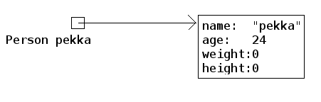
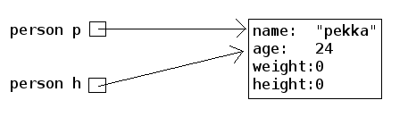
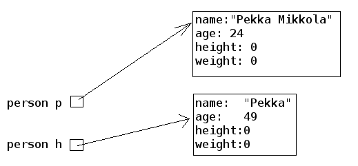
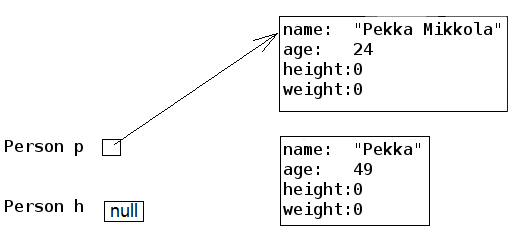
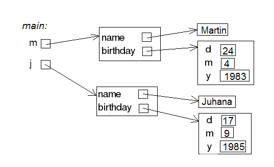



### Object is at the end of a wire

In chapter 20, we noted that `ArrayList` is at the end of a wire. Also objects are 'at the end of a wire'. What does this mean? Let us inspect the following example:

```java
public static void main(String[] args) {
    Person pekka = new Person("Pekka", 24);

    System.out.println( pekka );
}
```

When we run the sentence `Person pekka = new Person("Pekka", 24);` an object is born. The object can be accessed through the variable `pekka`. Technically speaking, the object is not within the variable `pekka` (in the box 'pekka'), but pekka refers to the object that was born. In other words, the object is 'at the end of a wire' that is attached to a variable named `pekka`. The concept could be visualized like this:



Let us add to the program a variable `person` of the type `Person` and set its starting value to `pekka`. What happens now?

```java
public static void main(String[] args) {
    Person pekka = new Person("Pekka", 24);

    System.out.println( pekka );

    Person person = pekka;
    person.becomeOlder(25);

    System.out.println( pekka );
}
```

Prints:

```output
Pekka, age 24 years
Pekka, age 49 years
```

In the beginning, Pekka was 24 years old. Then a `Person` object at the end of a wire attached to a `Person` variable is aged by 25 years and as a consequence of that Pekka becomes older! What is going on here?

The command `Person person = pekka;` makes `person` refer to the same object that pekka refers to. So, a copy of the object is not born, but instead both of the variables refer to the same object. With the command `Person person = pekka;` a *copy of the wire* is born. The same thing as a picture (Note: in the picture p refers to the variable `pekka`, and h to the variable person in the main program. The variable names have also been abbreviated in some of the following pictures.):



In the example, "an unknown `person` steals Pekka's identity". In the following, we have expanded the example so that a new object is created and `pekka` begins to refer to a new object:

```java
public static void main(String[] args) {
    Person pekka = new Person("Pekka", 24);

    System.out.println( pekka );

    Person person = pekka;
    person.becomeOlder(25);

    System.out.println( pekka );

    pekka = new Person("Pekka Mikkola", 24);
    System.out.println( pekka );
}
```

Prints:

```output
Pekka, age 24 years
Pekka, age 49 years
Pekka Mikkola, age 24 years
```

The variable `pekka` refers to one object, but then begins to refer to another. Here is the situation after running the previous line of code:



Let's develop the example further by making `person` to refer to 'nothing', to `null`:

```java
public static void main(String[] args) {
    Person pekka = new Person("Pekka", 24);

    System.out.println( pekka );

    Person person = pekka;
    person.becomeOlder(25);

    System.out.println( pekka );

    pekka = new Person("Pekka Mikkola", 24);
    System.out.println( pekka );

    person = null;
    System.out.println( person );
}
```

After running that, the situation looks like this:



Nothing refers to the second object. The object has become 'garbage'. Java's garbace collector cleans up the garbage every now and then by itself. If this did not happen, the garbage would pile up in the computer's memory until the execution of the program is done.

We notice this on the last line whine we try to print 'nothing' (`null`) on the last line:

```output
Pekka, age 24 years
Pekka, age 49 years
Pekka Mikkola, age 24 years
null
```

What happens if we try to call a "nothing's" method, for example the method `weightIndex`:

```java
public static void main(String[] args) {
    Person pekka = new Person("Pekka", 24);

    System.out.println( pekka );

    Person person = null;
    System.out.println( person.weightIndex() );
}
```

Result:

```output
Pekka, age 24 years
~~Exception in thread "main" java.lang.NullPointerException
        at Main.main(Main.java:20)
Java Result: 1~~
```

Not good. This might be the first time in your life that you see the text **NullPointerException**. But we can assure you that it will not be the last. NullPointerException is an exception state, when we try to call methods of an object with the value `null`.

### An object as a method parameter

We have seen that a method can have, for example `int`, `double`, `String` or `ArrayList` as its parameter. ArrayLists and character strings are objects, so as one might guess a method can take any type of object as a parameter. Let us demonstrate this with an example.

People whose weight index exceeds a certain limit are accepted into the Weight Watchers. The limit is not the same in all Weight Watchers associations. Let us make a class corresponding to the Weight Watchers association. As the object is being created, the lowest acceptance limit is passed to the constructor as a parameter.

```java
public class WeightWatchersAssociation {
    private double lowestWeightIndex;

    public WeightWatchersAssociation(double indexLimit) {
        this.lowestWeightIndex = indexLimit;
    }

}
```

Next we will create a method, with which we can check if a person is eligible to the association, in other words we check if a person's weight index is large enough. The method returns `true` if the person that is passed in as a parameter is eligible and false if not.

```java
public class WeightWatchersAssociation {
    // ...

    public boolean isAcceptedAsMember(Person person) {
        if ( person.weightIndex() < this.lowestWeightIndex ) {
            return false;
        }

        return true;
    }
}
```

The method `isAcceptedAsMember` of the `WeightWatchersAssociation` object gets a `Person` object as its parameter (or more accurately the wire to the person), and then calls the method `weightIndex` of the person that it received as a parameter.

In the following, is a test main program in which a person object `matti` and a person object `juhana` is passed to the weight watchers association's method:

```java
public static void main(String[] args) {
    Person matti = new Person("Matti");
    matti.setWeight(86);
    matti.setHeight(180);

    Person juhana = new Person("Juhana");
    juhana.setWeight(64);
    juhana.setHeight(172);

    WeightWatchersAssociation kumpulasWeight = new WeightWatchersAssociation(25);

    if ( kumpulasWeight.isAcceptedAsMember(matti) ) {
        System.out.println( matti.getName() + " is accepted as a member");
    } else {
        System.out.println( matti.getName() + " is not accepted as a member");
    }

    if ( kumpulasWeight.isAcceptedAsMember(juhana) ) {
        System.out.println( juhana.getName() + " is accepted as a memberksi");
    } else {
        System.out.println( juhana.getName() + " is not accepted as a member");
    }
}
```

The program prints:

```output
Matti is accepted as a member
Juhana is not accepted as a member
```



{: .exercises }

### Another object of the same type as a parameter to a method

We will keep on working with the `Person` class. As we recall, persons know their age:

```java
public class Person {

    private String name;
    private int age;
    private int height;
    private int weight;

    // ...
}
```

We want to compare ages of two persons. The comparison can be done in a number of ways. We could define a getter method `getAge` for a person. Comparing two persons in that case would be done like this:

```java
Person pekka = new Person("Pekka");
Person juhana = new Person("Juhana")

if ( pekka.getAge() > juhana.getAge() ) {
    System.out.println(pekka.getName() + " is older than " + juhana.getName());
}
```

We will learn a slightly more object-oriented way to compare the ages of two people.

We will create a method `boolean olderThan(Person compared)` for the `Person` class, with which we can compare a certain person with a person that is given as a parameter.

The method is meant to be used in the following way:

```java
public static void main(String[] args) {
    Person pekka = new Person("Pekka", 24);
    Person antti = new Person("Antti", 22);

    if (pekka.olderThan(antti)) {  //  same as pekka.olderThan(antti)==true
        System.out.println(pekka.getName() + " is older than " + antti.getName());
    } else {
        System.out.println(pekka.getName() + " isn't older than " + antti.getName());
    }
}
```

Here, we ask Pekka if he is older than Antti, Pekka replies true if he is, and false if he is not. In practice, we call the method `olderThan` of the object that `pekka` refers to. For this method, we give as a parameter the object that antti refers to.

The program prints:

```output
Pekka is older than Antti
```

The program gets a person object as its parameter (or more accurately a reference to a person object, which is at 'the end of a wire') and then compares its own age `this.age` to the age of the compared `compared.age`. The implementation looks like this:

```java
public class Person {
    // ...

    public boolean olderThan(Person compared) {
        if ( this.age > compared.age ) {
            return true;
        }

        return false;
    }
}
```

Even though age is a private object variable, we can read the value of the variable by writing compared.age. This is because `private` variables can be read in all methods that the class in question contains. Note that the syntax resembles the call of a method of an object. Unlike calling a method, we refer to a field of an object, in which case we do not write the parentheses.

### The date as an object

Another example of the same theme. Let us create a class, which can represent dates.

Within an object, the date is represented with three object variables. Let us also make a method, which can compare whether the date is earlier than a date that is given as a parameter:

```java
public class MyDate {
    private int day;
    private int month;
    private int year;

    public MyDate(int day, int month, int year) {
        this.day = day;
        this.month = month;
        this.year = year;
    }

    public String toString() {
        return this.day + "." + this.month + "." + this.year;
    }

    public boolean earlier(MyDate compared) {
        // first we'll compare years
        if ( this.year < compared.year ) {
            return true;
        }

        // if the years are the same, we'll compare the months
        if ( this.year == compared.year && this.month < compared.month ) {
            return true;
        }

        // years and months the same, we'll compare the days
        if ( this.year == compared.year && this.month == compared.month &&
                this.day < compared.day ) {
            return true;
        }

        return false;
    }
}
```

Example of usage:

```java
public static void main(String[] args) {
    MyDate p1 = new MyDate(14, 2, 2011);
    MyDate p2 = new MyDate(21, 2, 2011);
    MyDate p3 = new MyDate(1, 3, 2011);
    MyDate p4 = new MyDate(31, 12, 2010);

    System.out.println( p1 + " earlier than " + p2 + ": " + p1.earlier(p2));
    System.out.println( p2 + " earlier than " + p1 + ": " + p2.earlier(p1));

    System.out.println( p2 + " earlier than " + p3 + ": " + p2.earlier(p3));
    System.out.println( p3 + " earlier than " + p2 + ": " + p3.earlier(p2));

    System.out.println( p4 + " earlier than " + p1 + ": " + p4.earlier(p1));
    System.out.println( p1 + " earlier than " + p4 + ": " + p1.earlier(p4));
}
```

```output
14.2.2011 earlier than 21.2.2011: true
21.2.2011 earlier than 14.2.2011: false
21.2.2011 earlier than 1.3.2011: true
1.3.2011 earlier than 21.2.2011: false
31.12.2010 earlier than 14.2.2011: true
14.2.2011 earlier than 31.12.2010: false
```


{: .exercises }

### Objects on a list

We've used `ArrayLists` in a lot of examples and assignments already. You can add character strings, for example, to an `ArrayList` object and going through the strings, searching, removing and sorting them and so forth, are painless actions.

You can put any type of objects in ArrayLists. Let's create a person list, an `ArrayList<Person>` and put a few person objects in it:

```java
public static void main(String[] args) {
    ArrayList<Person> teachers = new ArrayList<Person>();

    // first we can take a person into a variable
    Person teacher = new Person("Juhana");
    // and then add it to the list
    teachers.add(teacher);

    // or we can create the object as we add it:
    teachers.add( new Person("Matti") );
    teachers.add( new Person("Martin") );

    System.out.println("teachers as newborns: ");
    for ( Person prs : teachers ) {
        System.out.println( prs );
    }

    for ( Person prs : teachers ) {
        prs.becomeOlder( 30 );
    }

    System.out.println("in 30 years: ");
    for ( Person prs : teachers ) {
        System.out.println( prs );
    }
}
```

The program prints:

```output
teachers as newborns:
Juhana, age 0 years
Matti, age 0 years
Martin, age 0 years
in 30 years:
Juhana, age 30 years
Matti, age 30 years
Martin, age 30 years
```


{: .exercises }

### An object within an object

Objects can have objects within them, not only character strings but also self-defined objects. Let's get back to the `Person`-class again and add a birthday for the person. We can use the `MyDate`-object we created earlier here:

```java
public class Person {
    private String name;
    private int age;
    private int weight;
    private int height;
    private MyDate birthMyDate;

    // ...
```

Let's create a new constructor for persons, which enables setting a birthday:

```java
    public Person(String name, int day, int month, int year) {
        this.name = name;
        this.weight = 0;
        this.height = 0;
        this.birthMyDate = new MyDate(day, month, year);
    }
```

So because the parts of the date are given as constructor parameters (day, month, year), the date object is created out of them and then *inserted* to the object variable `birthMyDate`.

Let's edit `toString` so that instead of age, it displays the birthdate:

```java
public String toString() {
    return this.name + ", born " + this.birthMyDate;
}
```

And then let's test how the renewed `Person` class works:

```java
public static void main(String[] args) {
    Person martin = new Person("Martin", 24, 4, 1983);

    Person juhana = new Person("Juhana", 17, 9, 1985);

    System.out.println( martin );
    System.out.println( juhana );
}
```

Prints:

```output
Martin, born 24.4.1983
Juhana, born 17.9.1985
```

In chapter 24.4, we noted that objects are 'at the end of a wire'. Take a look at that chapter again for good measure.

Person objects have the object variables `name`, which is a String-object and `birthMyDate`, which is a MyDate object. The variables of person are consequently both objects, so technically speaking they don't actually exist within a person object, but are 'at the end of a wire'. In other words a person has a reference to the objects stored in its object variables. The concept as a picture:



The main program now has two person programs at the ends of wires. The persons have a name and a birthdate. Because both are objects, both are at the ends of wires the person holds.

Birthday seems like a good expansion to the Person class. We notice, however, that the object variable `age` is becoming obsolete and should probably be removed since the age can be determined easily with the help of the current date and birthday. In Java, the current day can be figured out, for example, like this:

```java
int day = Calendar.getInstance().get(Calendar.DATE);
int month = Calendar.getInstance().get(Calendar.MONTH) + 1; // January is 0 so we add 1
int year = Calendar.getInstance().get(Calendar.YEAR);
System.out.println("Today is " + day + "." + month + "." + year );
```

When age is removed, the `olderThan` method has to be changed so that it compares birthdates. We'll do this as an excersise assignment.


{: .exercises }

### A list of objects within an object

Let's expand the `WeightWatchersAssociation` object so that the association records all its members into an `ArrayList` object. So in this case the list will be filled with `Person` objects. In the extended version the association is given a name as a constructor parameter:

```java
public class WeightWatchersAssociation {
    private double lowestWeightIndex;
    private String name;
    private ArrayList<Person> members;

    public WeightWatchersAssociation(String name, double lowestWeightIndex) {
        this.lowestWeightIndex = lowestWeightIndex;
        this.name = name;
        this.members = new ArrayList<Person>();
    }

    //..
}
```

Let's create a method with which a person is added to the association. The method won't add anyone to the association but people with a high enough weight index. Let's also make a `toString` with which the members' names are printed:

```java
public class WeightWatchersAssociation {
    // ...

    public boolean isAccepted(Person person) {
        if ( person.weightIndex() < this.lowestWeightIndex ) {
            return false;
        }

        return true;
    }

    public void addAsMember(Person person) {
        if ( !isAccepted(person) ) { // same as isAccepted(person) == false
            return;
        }

        this.members.add(person);
    }

    public String toString() {
        String membersAsString = "";

        for ( Person member : this.members ) {
            membersAsString += "  " + member.getName() + "\n";
        }

        return "Weightwatchers association " + this.name + " members: \n" + membersAsString;
    }
}
```

The method `addAsMember` uses the method isAccepted that was creater earlier.

Let's try out the expanded weightwatchers association:

```java
public static void main(String[] args) {
    WeightWatchersAssociation weightWatcher = new WeightWatchersAssociation("Kumpulan paino", 25);

    Person matti = new Person("Matti");
    matti.setWeight(86);
    matti.setHeight(180);
    weightWatcher.addAsMember(matti);

    Person juhana = new Person("Juhana");
    juhana.setWeight(64);
    juhana.setHeight(172);
    weightWatcher.addAsMember(juhana);

    Person harri = new Person("Harri");
    harri.setWeight(104);
    harri.setHeight(182);
    weightWatcher.addAsMember(harri);

    Person petri = new Person("Petri");
    petri.setWeight(112);
    petri.setHeight(173);
    weightWatcher.addAsMember(petri);

    System.out.println( weightWatcher );
}
```

In the output we can see that Juhana wasn't accepted as a member:

```output
The members of weight watchers association 'kumpulan paino':
  Matti
  Harri
  Petri
```


{: .exercises }


### Method returns an object

We've seen methods that return booleans, numbers, lists and strings. It's easy to guess that a method can return any type of an object. Let's make a method for the weight watchers association that returns the person with the highest weight index.

```java
public class WeightWatchersAssociation {
    // ...

    public Person personWithHighestWeightIndex() {
        // if members list is empty, we'll return null-reference
        if ( this.members.isEmpty() ) {
            return null;
        }

        Person heaviestSoFar = this.members.get(0);

        for ( Person person : this.members) {
            if ( person.weightIndex() > heaviestSoFar.weightIndex() ) {
                heaviestSoFar = person;
            }
        }

        return heaviestSoFar;
    }
}
```

The logic in this method works in the same way as when finding the largest number in a list. We use a dummy variable `heaviestSoFar` which is initially made to refer to the first person on the list. After that the list is read through and we see if there's anyone with a greater weight index in it, if so, we make `heaviestSoFar` refer to that one instead. At the end we return the value of the dummy variable, or in other words the *reference to a person object*.

Let's make an expansion to the previous main program. The main program receives the reference returned by the method to its variable heaviest.

```java
public static void main(String[] args) {
    WeightWatchersAssociation weightWatcher = new WeightWatchersAssociation("Kumpluan paino", 25);

    // ..

    Person heaviest = weightWatcher.personWithHighestWeightIndex();
    System.out.print("member with the greatest weight index: " + heaviest.getName() );
    System.out.println(" weight index " + String.format( "%.2f", heaviest.weightIndex() ) );
}
```

Prints:

```output
member with the greatest weight index: Petri
weight index 37,42
```

### Method returns an object it creates

In the last example a method returned one Person object that the WeightWatcers object had in it. It's also possible that a method returns an entirely new object. In the following is a simple counter that has a method `clone` with which a clone - an entirely new counter object - can be made from the counter, which at creation has the same value as the counter that is being cloned:

```java
public Counter {
    private int value;

    public Counter(){
        this(0);
    }

    public Counter(int initialValue){
        this.value = initialValue;
    }

    public void grow(){
        this.value++;
    }

    public String toString(){
        return "value: "+value;
    }

    public Counter clone(){
        // lets create a new counter object, that gets as its initial value
        // the value of the counter that is being cloned
        Counter clone = new Counter(this.value);

        // return the clone to the caller
        return clone;
    }
}
```

Here's a usage example:

```java
Counter counter = new Counter();
counter.grow();
counter.grow();

System.out.println(counter);         // prints 2

Counter clone = counter.clone();

System.out.println(counter);         // prints 2
System.out.println(clone);           // prints 2

counter.grow();
counter.grow();
counter.grow();
counter.grow();

System.out.println(counter);         // prints 6
System.out.println(clone);           // prints 2

clone.grow();

System.out.println(counter);         // prints 6
System.out.println(clone);           // prints 3
```

The value of the object being cloned and the value of the clone - after the cloning has happened - are the same. However they are two different objects, so in the future as one of the counters grows the value of the other isn't affected in any way.


{: .exercises }

##  More assignments

All the new theory for this week has already been covered. However, since this week's topics are quite challenging, we will practise our routine with a couple of more exercises.



{: .exercises }
