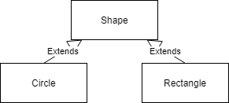



## Overwriting Methods & Polymorphism

Let's take the example of shapes. There are a number of different geometrical shapes. In this example we're focussing on the `Rectangle` and `Circle`. These shapes both have a color, a `Rectangle` has a `width` and `height`, but a `Circle` only has a radius. We can summarize this in the following diagram. With these shapes, we would like to be able to calculate the surface area and circumference.



We can start implementing the shape class

```java
class Shape {
    private Color color;

    public Shape(Color color) {
        this.color = color;
    }
}

class Rectangle extends Shape {
    private int width;
    private int height;
    
    public Rectangle(Color color, int width, int height) {
        super(color);
        this.width = width;
        this.height = height;
    }

    public int getArea() {
        return this.width * this.height;
    }
    public int getCircumference() {
        return 2 * this.width + 2 * this.height;
    }
}

class Circle extends Shape {
    private int radius;

    public Circle(Color color, int radius) {
        super(color);
        this.radius = radius;
    }
    public double getArea() {
        return Math.PI * this.radius * this.radius;
    }
    public double getCircumference() {
        return 2 * Math.PI * this.radius;
    }
}
```

By using the same polymorphism we saw in week 10 with interfaces, we can now assign a new Circle into a Shape object variable

```java
Shape circle = new Circle(Color.red, 10);
```

But, just like with interfaces, only the methods defined in `Shape` are available for use

```java
Shape circle = new Circle(Color.red, 10);
System.out.println(circle.getArea()); // won't work
```

### Polymorphism

This is a problem, as we would like to be able to use the generic superclass as a variable type too, like with interfaces. To fix this, we can add the `getArea()` and `getCircumference()` methods in the `Shape` class, and **overwrite** this method in the *subclass*es. To overwrite a file, the method needs to have the same header, meaning the return type and parameters must be the same. In this case, we choose to use a `double` returntype for the methods, so they are all the same

```java
class Shape {
    private Color color;

    public Shape(Color color) {
        this.color = color;
    }
    public double getArea() { return 0; }
    public double getCircumference() { return 0; }
}

class Rectangle extends Shape {
    private int width;
    private int height;
    
    public Rectangle(Color color, int width, int height) {
        super(color);
        this.width = width;
        this.height = height;
    }

    public double getArea() {
        return this.width * this.height;
    }
    public double getCircumference() {
        return 2 * this.width + 2 * this.height;
    }
}

class Circle extends Shape {
    private int radius;

    public Circle(Color color, int radius) {
        super(color);
        this.radius = radius;
    }
    public double getArea() {
        return Math.PI * this.radius * this.radius;
    }
    public double getCircumference() {
        return 2 * Math.PI * this.radius;
    }
}
```

Now the methods in the subclasses overwrite the one in the superclass, and can be called, **even if the variable used is a superclass type**. This is called **overriding**

```java
Circle circle1 = new Circle(Color.red, 10);
System.out.println(circle1.getArea()); //works
Shape circle2 = new Circle(Color.green, 10);
System.out.println(circle2.getArea()); // works too :)
Shape rect = new Rectangle(Color.blue, 10, 10); //also works


Circle circle3 = new Shape(Color.blue); // does not work...
```

This principle is called **polymorphism**. With this, we can have a variable of a superclass, containing an object of a subclass. When calling methods, java will automatically determine the object contained in the variable, and call the method of the **lowest** subclass applicable. This means if we have multiple levels of subclassing, A, B and C, the lowest subclass implementing a method will be called

```java
class A {
    public void print() {
        System.out.println("A");
    }
}

class B extends A {
    public void print() {
        System.out.println("B");
    }
}

class C extends B {
}


public static void main(String[] args) {
    A variable = new C();
    variable.print();
}
```

```output
B
```

By overwriting a method, the 'old' method in the superclass won't be used anymore. It is possible to use the old method in the superclass to add new functionality and calling the super functionality, by using the `super` keyword

```java
class A {
    public void print() {
        System.out.println("A");
    }
}

class B extends A {
    public void print() {
        super.print();
        System.out.println("B");
    }
}

class C extends B {
}


public static void main(String[] args) {
    A variable = new C();
    variable.print();
}
```

```output
A
B
```

### Overrides

As mentioned before, when overriding a method, java matches the overriding of a method by the return value and parameters of the method. However if the method changes in the superclass, it must also be changed in the subclass. This is **not** done automatically, and can be forgotten by the programmer. This is why in the subclass, we can add an 'annotation', a small marker, to indicate this method is overriding another method. Then, if the method changes in the superclass, and is accidentally not changed in the subclass, the java compiler will give an error. This annotating can be done with the `@Overrides` keyword, in front of the method

```java
class A {
    public void print() { 
        System.out.println("Printing in A"); 
    }
}

class B extends A {
    @Override
    public void print() {
        System.out.println("Override!");
    }
}
```

This way, if the name of the `print` method in class `A` changes, and it is not changed in `B`, java will give an error

### Exercises


{: .exercises }
