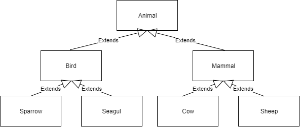



## Extending Classes

In java it's possible to extend classes to add functionality. By extending a class, you take over all the attributes, methods and constructors of the other class. By reusing the class in the other class, you only have to write this code once, and can reuse it in other classes, as if it were part of that class. An example could be classes about animals.

In the animal kingdom are lots of different animals, like a `Sparrow`, `Seagull`, `Cow` and `Pig`. All of these animals can make sounds. We can group these animals together though, into `Birds` and `Mammals`. A major difference between these 2 groups of animals, is that birds can fly. We can model this in the following scheme



In this example, all animals can make a sound, so we will want to share this functionality among all classes

```java
class Animal {
    private String sound;

    public Animal() {
        this.sound = "";
    }

    public void setSound(String sound) {
        this.sound = sound;
    }

    public void makeSound() {
        System.out.println(this.sound + "!!!!");
    }
}
```

With this class, all the animals share the functionality to make a sound. We can extend this to groups of animals, using the `extends` keyword. We can add functionality to the `Bird` and `Mammal` classes, birds can fly, while mammals can walk (birds usually hop instead of walking)

```java
class Bird extends Animal {
    public Bird() {
    }

    public void fly() {
        System.out.println("The bird is flying");
    }
}

class Mammal extends Animal {
    public Mammal() {
    }

    public void walk() {
        System.out.println("The mammal is walking");
    }
}
```

Now we can make some animals to go with these classes.

```java
class Sparrow extends Bird {
    public Sparrow() {
        this.setSound("chirp");
    }
}

class Seagull extends Bird {
    public Seagull() {
        this.setSound("Squaaa");
    }
}

class Cow {
    public Cow() {
        this.setSound("moo");
    }
}

class Pig {
    public Pig() {
        this.setSound("oink");
    }
}
```

Now we can start using these classes. All classes can only do the things they are supposed to do

```java

public static void main(String[] args) {
    Cow cow = new Cow();
    cow.makeSound();
    cow.walk();
    //cow.fly();        cows can't fly

    Sparrow spwarrow = new Sparrow();
    sparrow.makeSound();
    sparrow.fly();
    //sparrow.walk()    sparrows can't walk
}
```

```output
moo!!!!
the mammal is walking
chirp!!!!
The bird is flying
```

### Superclass

The class that is being extended, is called the `superclass`. The class that is extending, is called the `subclass`

In the example of the animals, 
- `Animal` is the **superclass** of `Bird` and `Mammal`
- `Bird` is the **superclass** of `Sparrow` and `Seagull`
- `Mammal` is the **superclass** of `Cow` and `Pig`
- `Bird`, `Mammal`, `Sparrow`, `Seagull`, `Cow` and `Pig` are all **subclass**es of `Animal`
- `Sparrow` and`Seagull` are  **subclass**es of `Bird`
- `Cow` and `Pig` are  **subclass**es of `Mammal`


In java, the superclass can be used by using the `super` keyword. With `super`, we can call the constructor of the superclass, or call a method in a superclass. Methods can also be called using the `this` keyword. 

### Constructors in the superclass

If a superclass has a constructor with parameters, and no constructor without parameters, the superclass's constructor **must** be called using `super(...)` in the constructor of the **subclass**.

By calling the super constructor, we can shorten the example of the animal kingdom, by adding the sound to the constructor of the Animal class.

```java
class Animal {
    private String sound;
    
    public Animal(String sound) {
        this.sound = sound;
    }
}

class Bird extends Animal {
    public Bird(String sound) {
        super(sound);
    }
}

class Mammal extends Animal {
    public Mammal(String sound) {
        super(sound);
    }
}

class Sparrow extends Bird {
    public Sparrow() {
        super("chirp");
    }
}

class Seagull extends Bird {
    public Seagull() {
        super("Squaaa");
    }
}

class Cow {
    public Cow() {
        super("moo");
    }
}

class Pig {
    public Pig() {
        super("oink");
    }
}
```

By adding the sound as a parameter of the `Animal` class constructor, we *enforce* that the sound is always set. This makes for a better design, as this makes it hard to make an Animal that does not have a sound because the programmer forgot to add a sound.

**Note:** The `super` constructor should **always** be called before all other code in a constructor. If you do not put the `super` constructor first, java will throw an error while compiling.



{: .exercises }
