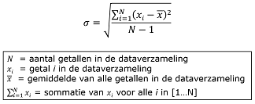
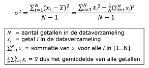



## Statistics

> We have prepared a video clip that introduces the statistical quantities median, mode and standard deviation. You should watch that video and do the **exercise** in the video. The video clip is Dutch spoken and is called "Statistiek - Mediaan, modus en standaarddeviatie".

### Median and average

The median is the *middle* value of a series of values.

If the distribution of values is approximately symmetrical around the average, the values of the median and the average will be very similar. However, sometimes the distribution is not symmetrical around the average, for example the lower values are close to each other but the high values are spread out with a few very high values that are far from the average. In such a case the average doesn't indicate the 'middle' of the range of values very well. A better indication of the 'middle' value is the *median*. By definition, there are equal numbers of values above and below the median. If the number of values is odd, there is one value in the middle. If the number of values is even, there are two middle values and the median is chosen to be the average of those two middle values.

### Standard deviation

The standard deviation is a value that indicates how the values in a series are distributed around the average. A high standard deviation indicates that values are spread out widely around the average. A low standard deviation indicates that values are close to the average.

The video clip mentioned previously provides the formula for calculating the standard deviation (in Dutch):

### Variance

The standard deviation and the variance are closely related: the standard deviation is the square root of the variance. You might also say that the variance is the square of the standard deviation.

The formula for calculating the variance (also in Dutch):

As can be seen from the formula, the variance can be calculated using two loops, one after the other, the first one for calculating the average, the second one for calculating the variance as the distance from the average squared divided by N-1. This is the left hand side of the formula above.

However, the variance can also be calculated in a single loop that calculates both the sum of the square of the values and the sum of the values, after which these values can be used to determine the variance. This is the right hand side of the formula above.

### Mode

The mode is the value in a series of values that occurs the most in that series.

If values are discrete (e.g. integers), the mode can be one of the values in the series. If values are continuous (e.g. floating point), the mode cannot be directly determined because each value basically occurs only once (the chance of two continuous values being equal is extremely small). Therefore, to calculate the mode for continous values we divide those values into 'bins' (ranges of values) and look at the number of values in each 'bin'. The mode will then be the 'bin' (the value range) that contains the largest number of values.




{: .exercises }
